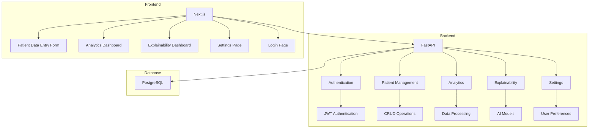

```mermaid
graph TD
    subgraph Backend
        A[FastAPI] --> B[Authentication]
        A --> C[Patient Management]
        A --> D[Analytics]
        A --> E[Explainability]
        A --> F[Settings]
        B --> G[JWT Authentication]
        C --> H[CRUD Operations]
        D --> I[Data Processing]
        E --> J[AI Models]
        F --> K[User Preferences]
    end

    subgraph Database
        L[PostgreSQL]
    end

    subgraph Frontend
        M[Next.js]
        M --> N[Patient Data Entry Form]
        M --> O[Analytics Dashboard]
        M --> P[Explainability Dashboard]
        M --> Q[Settings Page]
        M --> R[Login Page]
    end

    A --> L
    M --> A
```
